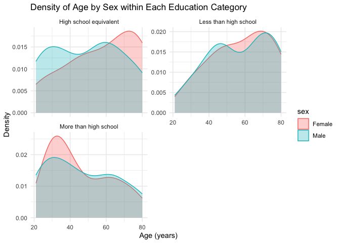
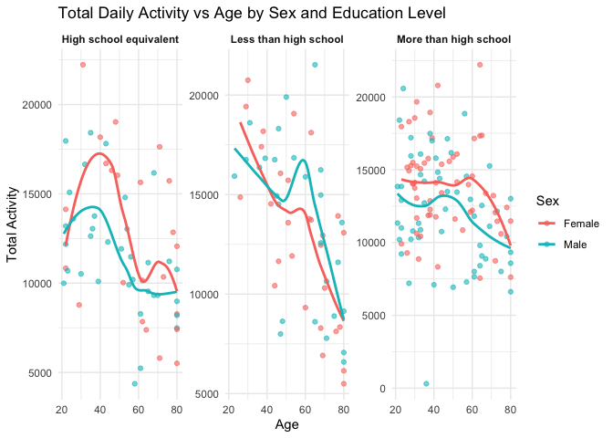

p8105_hw3_cz2955
================
2025-10-06

## Problem 1

### Load data:

``` r
library(p8105.datasets)
data("instacart")
```

This dataset comprises partial information from Instacart order data,
containing users’ historical orders and itemised details of goods within
those orders. Each row in the data represents a specific item purchased
by a user during a particular order. Key variables include order_id,
product_id, add_to_cart_order, reordered, user_id, eval_set,
order_number, order_dow, order_hour_of_day, days_since_prior_order,
product_name, aisle_id, department_id, aisle, department. There are
total 1384617variables. The average reorder rate across all items is
0.599, indicating that a significant fraction of purchases are repeat
orders. \### (a):

``` r
length(unique(instacart$aisle))
```

    ## [1] 134

``` r
aisle_counts <- instacart%>%
  group_by(aisle)%>%
  summarise(num_orders = n())%>%
  arrange(desc(num_orders))

head(aisle_counts)
```

    ## # A tibble: 6 × 2
    ##   aisle                         num_orders
    ##   <chr>                              <int>
    ## 1 fresh vegetables                  150609
    ## 2 fresh fruits                      150473
    ## 3 packaged vegetables fruits         78493
    ## 4 yogurt                             55240
    ## 5 packaged cheese                    41699
    ## 6 water seltzer sparkling water      36617

### (b):

``` r
aisle_counts_large <- aisle_counts %>%
  filter(num_orders > 10000)
ggplot(aisle_counts_large, aes(x = reorder(aisle, -num_orders), y = num_orders)) +
  geom_bar(stat = "identity", fill = "steelblue") +
  labs(title = "Number of Items Ordered by Aisle",
       x = "Aisle",
       y = "Number of Items Ordered") +
  theme_minimal() +
  theme(axis.text.x = element_text(angle = 45, hjust = 1))
```

<!-- -->

### (c):

``` r
popular_items <- instacart %>%
  filter(aisle %in% c("baking ingredients", "dog food care", "packaged vegetables fruits")) %>% 
  group_by(aisle, product_name) %>% 
  summarise(num_orders = n()) %>% 
  arrange(aisle, desc(num_orders)) %>%
  slice_head(n = 3)
```

    ## `summarise()` has grouped output by 'aisle'. You can override using the
    ## `.groups` argument.

``` r
popular_items
```

    ## # A tibble: 9 × 3
    ## # Groups:   aisle [3]
    ##   aisle                      product_name                             num_orders
    ##   <chr>                      <chr>                                         <int>
    ## 1 baking ingredients         Light Brown Sugar                               499
    ## 2 baking ingredients         Pure Baking Soda                                387
    ## 3 baking ingredients         Cane Sugar                                      336
    ## 4 dog food care              Snack Sticks Chicken & Rice Recipe Dog …         30
    ## 5 dog food care              Organix Chicken & Brown Rice Recipe              28
    ## 6 dog food care              Small Dog Biscuits                               26
    ## 7 packaged vegetables fruits Organic Baby Spinach                           9784
    ## 8 packaged vegetables fruits Organic Raspberries                            5546
    ## 9 packaged vegetables fruits Organic Blueberries                            4966

### (d)

``` r
mean_order_hour <- instacart %>%
  filter(product_name %in% c("Pink Lady Apples", "Coffee Ice Cream")) %>%
  group_by(product_name, order_dow) %>% 
  summarise(mean_hour = mean(order_hour_of_day, na.rm = TRUE)) %>% 
  pivot_wider(names_from = order_dow, values_from = mean_hour) %>% 
  arrange(product_name)
```

    ## `summarise()` has grouped output by 'product_name'. You can override using the
    ## `.groups` argument.

``` r
mean_order_hour
```

    ## # A tibble: 2 × 8
    ## # Groups:   product_name [2]
    ##   product_name       `0`   `1`   `2`   `3`   `4`   `5`   `6`
    ##   <chr>            <dbl> <dbl> <dbl> <dbl> <dbl> <dbl> <dbl>
    ## 1 Coffee Ice Cream  13.8  14.3  15.4  15.3  15.2  12.3  13.8
    ## 2 Pink Lady Apples  13.4  11.4  11.7  14.2  11.6  12.8  11.9

## Problem 2

``` r
# Table1
Zip_Codes<-read_csv("Zip_Codes.csv")|>
  select(County, ZipCode, Neighborhood) |>
  mutate(
    ZipCode = as.integer(ZipCode),
    County = as.character(County),
    Neighborhood = as.character(Neighborhood)
    )
```

    ## Rows: 322 Columns: 7
    ## ── Column specification ────────────────────────────────────────────────────────
    ## Delimiter: ","
    ## chr (4): County, County Code, File Date, Neighborhood
    ## dbl (3): State FIPS, County FIPS, ZipCode
    ## 
    ## ℹ Use `spec()` to retrieve the full column specification for this data.
    ## ℹ Specify the column types or set `show_col_types = FALSE` to quiet this message.

``` r
# Tablke2
Zip_NYC<-read_csv("Zip_NYC.csv")|>
  rename(ZipCode = RegionName,
         County = CountyName
         ) |>
  mutate(
    ZipCode = as.integer(ZipCode),
    County = str_replace(County, " County", "")
  )|>
  select(ZipCode, County, starts_with("201"), starts_with("202"))|>
  pivot_longer(
    cols = -c(ZipCode, County),
    names_to = "Date",
    values_to = "RentPrice"
  )
```

    ## Rows: 149 Columns: 125
    ## ── Column specification ────────────────────────────────────────────────────────
    ## Delimiter: ","
    ## chr   (6): RegionType, StateName, State, City, Metro, CountyName
    ## dbl (119): RegionID, SizeRank, RegionName, 2015-01-31, 2015-02-28, 2015-03-3...
    ## 
    ## ℹ Use `spec()` to retrieve the full column specification for this data.
    ## ℹ Specify the column types or set `show_col_types = FALSE` to quiet this message.

``` r
# Merge Table1, 2
z_together <- Zip_NYC |>
  left_join(Zip_Codes, by = c("ZipCode", "County"))

zip_counts <- z_together %>%
  drop_na(RentPrice) %>%
  group_by(ZipCode) %>%
  summarize(obs_count = n(), distinct_county = n_distinct(County)) %>%
  ungroup()

# Oberservation=116 times
n_116 <- zip_counts %>% 
  filter(obs_count == 116) %>% 
  nrow()

# Oberservation<10 times
n_lt10 <- zip_counts %>% 
  filter(obs_count < 10) %>% 
  nrow()
```

There are ZIP codes observed 116 times and ZIP codes are fewer than 10
times. Certain postcodes yield monthly data due to high rental activity
and ample property listings within these areas; conversely, some
postcodes show infrequent observations owing to small market size,
infrequent listings, or incomplete data collection. Rental data is
observed monthly for certain postcodes, typically because these areas
feature active rental markets with ample supply and consistent data
collection coverage.

### Table showing the average rental price

``` r
# Table for average price
avg_rent <- z_together %>%
  mutate(Year = floor_date(as.Date(Date), unit = "year")) %>%  
  group_by(County, Year) %>%
  summarize(
    AvgRent = mean(RentPrice, na.rm = TRUE),
    .groups = "drop"
  ) %>% 
  mutate(Year = year(Year))

head(avg_rent)
```

    ## # A tibble: 6 × 3
    ##   County  Year AvgRent
    ##   <chr>  <dbl>   <dbl>
    ## 1 Bronx   2015   1760.
    ## 2 Bronx   2016   1520.
    ## 3 Bronx   2017   1544.
    ## 4 Bronx   2018   1639.
    ## 5 Bronx   2019   1706.
    ## 6 Bronx   2020   1811.

``` r
p1 <- ggplot(avg_rent, aes(x = Year, y = AvgRent, color = County)) +
  geom_line(size = 1.2) +
  geom_point(size = 2) +
  labs(
    title = "NYC Rental Prices within ZIP codes for all available years",
    x = "Year",
    y = "Rental Prices ($)",
    color = "County"
  ) +
  theme_minimal() +
    scale_x_continuous(
    breaks = seq(min(avg_rent$Year, na.rm = TRUE),
                 max(avg_rent$Year, na.rm = TRUE),
                 by = 1) 
  ) +
  theme(axis.text.x = element_text(angle = 45, hjust = 1))
```

    ## Warning: Using `size` aesthetic for lines was deprecated in ggplot2 3.4.0.
    ## ℹ Please use `linewidth` instead.
    ## This warning is displayed once every 8 hours.
    ## Call `lifecycle::last_lifecycle_warnings()` to see where this warning was
    ## generated.

``` r
p1
```

    ## Warning: Removed 5 rows containing missing values or values outside the scale range
    ## (`geom_line()`).

    ## Warning: Removed 5 rows containing missing values or values outside the scale range
    ## (`geom_point()`).

<!-- -->

The line chart shows the average rental prices across New York City
boroughs over time. A few key patterns stand out: 1.Rental prices
generally increased from 2015 to 2024 across all boroughs, reflecting
rising housing demand and inflationary pressures in the NYC market.
2.Around 2020–2021, a temporary decline or plateau appears, likely
corresponding to the COVID-19 pandemic’s impact on the rental market as
urban migration slowed and vacancy rates increased.

### Average rental price within each ZIP code over each month in 2023

``` r
rent2023 <- z_together %>%
  mutate(Year = year(as.Date(Date)))%>%
  filter(Year == 2023) %>%
  group_by(County, ZipCode) %>%
  summarize(
    AvgRent2023 = mean(RentPrice, na.rm = TRUE),
    .groups = "drop"
  ) %>%
  drop_na(AvgRent2023)

library(tidyverse)
library(lubridate)

# 计算2023年各邮政编码的月平均租金
rent_2023 <- z_together %>%
  mutate(Year = year(as.Date(Date))) %>%
  filter(Year == 2023) %>%
  group_by(County, ZipCode) %>%
  summarize(
    AvgRent2023 = mean(RentPrice, na.rm = TRUE),
    .groups = "drop"
  ) %>%
  drop_na(AvgRent2023)

# Plotting the distribution of rents across administrative districts
p2 <- ggplot(rent_2023, aes(x = County, y = AvgRent2023, fill = County)) +
  geom_violin(trim = FALSE, alpha = 0.7) +
  labs(
    title = "Distribution of ZIP-Code-Level Rental Prices Across NYC Boroughs (2023)",
    x = "Borough",
    y = "Average Monthly Rent ($)"
  ) +
  theme_minimal(base_size = 14) +
  theme(
    legend.position = "none",
    axis.text.x = element_text(angle = 30, hjust = 1)
  )

p2
```

<!-- -->

### Combine the two previous plots

``` r
combined_plot <- p1 / p2
combined_plot
```

    ## Warning: Removed 5 rows containing missing values or values outside the scale range
    ## (`geom_line()`).

    ## Warning: Removed 5 rows containing missing values or values outside the scale range
    ## (`geom_point()`).

<!-- -->

``` r
ggsave("results/combined_plot.png", combined_plot, width = 12, height = 10, dpi = 300)
```

    ## Warning: Removed 5 rows containing missing values or values outside the scale range
    ## (`geom_line()`).
    ## Removed 5 rows containing missing values or values outside the scale range
    ## (`geom_point()`).

## Problem 3

``` r
# Demographic_data
demo_raw <- read_csv("demographic_data.csv") 
```

    ## New names:
    ## Rows: 254 Columns: 5
    ## ── Column specification
    ## ──────────────────────────────────────────────────────── Delimiter: "," chr
    ## (5): ...1, 1 = male, ...3, ...4, 1 = Less than high school
    ## ℹ Use `spec()` to retrieve the full column specification for this data. ℹ
    ## Specify the column types or set `show_col_types = FALSE` to quiet this message.
    ## • `` -> `...1`
    ## • `` -> `...3`
    ## • `` -> `...4`

``` r
colnames(demo_raw) <- demo_raw[4, ]     
demo <- demo_raw[-c(1:4), ] %>% 
  janitor::remove_empty(which = "cols") %>%
  mutate(
    SEQN = as.integer(SEQN),
    sex = recode(sex,
                 "1" = "Male",
                 "2" = "Female"),
    age = as.numeric(age),
    BMI = as.numeric(BMI),
    education = recode(education,
                       "1" = "Less than high school",
                       "2" = "High school equivalent",
                       "3" = "More than high school")
  )  %>% 
  filter(age >= 21) %>% 
  drop_na() %>% 
  clean_names() %>% 
  select(-bmi)  

# Accelerometer_data
accel <- read_csv("accelerometer_data.csv") %>% 
  clean_names() %>% 
  pivot_longer(
    cols = starts_with("min"),  
    names_to = "minute",     
    values_to = "value"
  ) %>%
  mutate(
    minute = as.integer(str_remove(minute, "min"))
  )%>% 
  drop_na()
```

    ## Rows: 250 Columns: 1441
    ## ── Column specification ────────────────────────────────────────────────────────
    ## Delimiter: ","
    ## dbl (1441): SEQN, min1, min2, min3, min4, min5, min6, min7, min8, min9, min1...
    ## 
    ## ℹ Use `spec()` to retrieve the full column specification for this data.
    ## ℹ Specify the column types or set `show_col_types = FALSE` to quiet this message.

``` r
# merge together
acc_together<-accel %>%
  left_join(demo, by = c("seqn" = "seqn"))%>% 
  drop_na()
```

### Table: the number of men and women in each education category

``` r
gender_edu_table <- demo %>%
  group_by(education, sex) %>%
  summarize(count = n(), .groups = "drop") %>%
  pivot_wider(names_from = sex, values_from = count)
gender_edu_table
```

    ## # A tibble: 3 × 3
    ##   education              Female  Male
    ##   <chr>                   <int> <int>
    ## 1 High school equivalent     23    35
    ## 2 Less than high school      28    27
    ## 3 More than high school      59    56

Overall, the largest cohort comprises individuals with higher
educational attainment (‘More than high school’), indicating a
significant proportion of highly educated participants within the
sample. Males are more prevalent in the secondary education group (high
school equivalent), while females slightly outnumber males in the higher
education group. This may reflect gender disparities across different
educational levels within the sample.

### Total activities (y-axis) against age (x-axis) plot

``` r
total_activity <- acc_together %>% 
  group_by(seqn, sex, age, education) %>%  
  summarize(total_activity = sum(value, na.rm = TRUE), .groups = "drop")
# Plot
ggplot(total_activity, aes(x = age, y = total_activity, color = sex)) +
  geom_point(alpha = 0.6) +           
  geom_smooth(method = "loess", se = FALSE) +  
  facet_wrap(~ education, scales = "free_y") + 
  labs(
    title = "Total Daily Activity vs Age by Sex and Education Level",
    x = "Age",
    y = "Total Activity",
    color = "Sex"
  ) +
  theme_minimal() +
  theme(strip.text = element_text(face = "bold"))
```

    ## `geom_smooth()` using formula = 'y ~ x'

<!-- -->
Trend lines indicate that overall activity levels generally decline with
age, though the rate of decline may differ between men and women.

### 

``` r
hourly_activity <- acc_together %>%
  mutate(hour = floor(as.numeric(gsub("min", "", minute)) / 60)) %>% 
  group_by(sex, education, hour) %>%
  summarize(avg_activity = mean(value, na.rm = TRUE), .groups = "drop")

ggplot(hourly_activity, aes(x = hour, y = avg_activity, color = sex)) +
  geom_line(size = 1) +            
  geom_smooth(method = "loess", se = FALSE, linetype = "dashed") + 
  facet_wrap(~ education, ncol = 1) + 
  labs(
    title = "Average 24-hour Activity Curves by Education Level and Sex",
    x = "Hour of the Day",
    y = "Average Activity",
    color = "Sex"
  ) +
  theme_minimal() +
  theme(strip.text = element_text(face = "bold"))
```

    ## `geom_smooth()` using formula = 'y ~ x'

<!-- -->
The trends observed in both males and females over a 24-hour period are
similar. Levels decline between 0 and 5 hours, rise between 5 and 10
hours, fluctuate evenly around 10 to 18 hours, and then decline again
between 18 and 24 hours.
